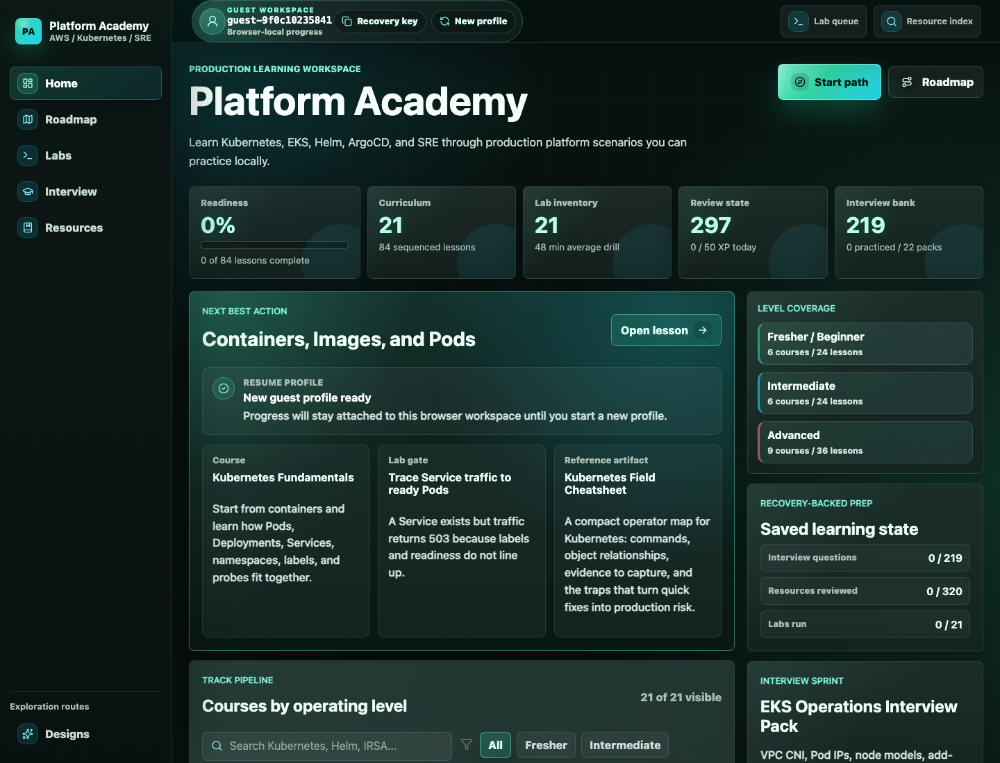

# On-Demand Learning / Platform Academy

[](https://github.com/Holdtillstill/on-demand-learning/actions/workflows/backend.yml)
[](https://github.com/Holdtillstill/on-demand-learning/actions/workflows/platform-academy-frontend.yml)
[](https://github.com/Holdtillstill/on-demand-learning/actions/workflows/docker-build.yml)
[](https://github.com/Holdtillstill/on-demand-learning/actions/workflows/platform-validate.yml)
[](https://github.com/Holdtillstill/on-demand-learning/actions/workflows/security.yml)
[](https://github.com/Holdtillstill/on-demand-learning/actions/workflows/platform-static-smoke.yml)
[](https://github.com/Holdtillstill/on-demand-learning/actions/workflows/dependency-audit.yml)
[](https://github.com/Holdtillstill/on-demand-learning/actions/workflows/secret-scan.yml)

Platform Academy is a local-first, production-style portfolio project for Kubernetes, EKS, Helm, ArgoCD, security, SRE, and platform engineering. The portfolio story is the full stack around the learning product: Docker Compose, FastAPI, React, PostgreSQL, Redis, a worker, metrics, traces, JSON logs, Kubernetes manifests, Terraform AWS scaffolding, CI/CD, SLOs, and runbooks.



## Development note

This project was built with AI-assisted coding support. Product direction,
architecture, validation, deployment choices, operations, and maintenance remain
my responsibility.

## Public status

| Surface | Status | Notes |
| --- | --- | --- |
| Static Platform Academy | Public static host | `platform-academy.bozhi.dev` serves the browsable learning workspace, static catalog snapshots, and browser-local guest work. |
| Full API runtime | Local and preview-ready | Progress, activity, recovery keys, and API-backed persistence run locally or in approved short-lived preview windows. |
| Observability | Local and preview-ready | Metrics, traces, logs, dashboards, and smoke checks are wired for local validation and shared runtime demos. |
| EKS runtime preview | Request-only | Shared EKS demos are temporary validation windows, not always-on learning infrastructure. |

## Quickstart

```bash
cp .env.example .env
make bootstrap          # uses python3.11 by default; override with PYTHON=/path/to/python
docker compose up --build
```

Open:

| Service | URL | Notes |
| --- | --- | --- |
| Platform Academy frontend | http://localhost:8090 | Kubernetes/EKS/Helm/ArgoCD/security/SRE learning app |
| API | http://localhost:8000/docs | FastAPI OpenAPI docs |
| API health | http://localhost:8000/healthz | Liveness |
| API readiness | http://localhost:8000/readyz | DB and Redis dependency check |
| API metrics | http://localhost:8000/metrics | Prometheus metrics |
| Prometheus | http://localhost:9090 | Scrapes API and worker |
| Grafana | http://localhost:3001 | `admin` / `admin` |
| Jaeger | http://localhost:16686 | Distributed traces |
| PostgreSQL | localhost:5433 | Host port avoids common local Postgres conflicts |
| Redis | localhost:6380 | Host port avoids common local Redis conflicts |

Optional heavier logging stack:

```bash
docker compose --profile logging up --build
```

Then open OpenSearch Dashboards at http://localhost:5601.

## What Is Built

- FastAPI backend with Platform Academy catalog/roadmap/labs/resources/interview prep, lessons, learning path, learner dashboard, XP, streaks, achievements, SRS review queue, progress, saved Platform Academy activity, search, flashcards, quiz attempts, nested course-upload endpoints, health/readiness, Prometheus metrics, OpenTelemetry tracing, request IDs, basic rate limiting, and JSON logs.
- Platform Academy React/Vite/TypeScript frontend with its own brand, navigation, level filters, roadmap, course pages, lesson pages, labs, resources, interview prep, browser-local guest profiles, and progress/XP display.
- Worker service that refreshes recommendations and due-card counts while emitting metrics, logs, and traces.
- PostgreSQL schema created by SQLAlchemy plus 21 seeded Platform Academy courses with 84 AWS/Kubernetes/SRE/platform engineering lessons.
- Dockerfiles and Docker Compose for app, DB, Redis, Prometheus, Grafana, Jaeger, and optional OpenSearch/Fluent Bit.
- Kubernetes deployment scaffolding with probes, HPAs, PDBs, network policy, ingress, configmaps, and secret template.
- Terraform scaffold for AWS `us-west-2`: VPC, EKS, ECR, S3, RDS, ElastiCache, IAM roles, and Budget alert.
- GitHub Actions for backend, Platform Academy frontend, Docker build, static CloudFront/S3 deploy, Platform Academy validation/image smoke, scheduled deployed smoke, dependency/security scans, and manual Kubernetes deploy template.

## CI and Security

- Backend and frontend workflows run API tests, worker tests, browser smoke
  checks, serious/critical accessibility checks, type checks, unit tests,
  production builds, and API-log audits.
- Platform validation covers public readiness, content counts, lab contracts,
  Kubernetes manifest contracts, Terraform validation, workflow contracts,
  static-host smoke, and release-check hygiene.
- Security workflows run blocking Gitleaks, Trivy filesystem vulnerability/secret
  scans, Docker image scans, CodeQL source analysis, `pip-audit`, `npm audit`,
  and Dependency Review for public pull requests. Trivy IaC/Kubernetes
  misconfiguration scanning remains advisory until production promotion because
  the repo includes lab fixtures and preview scaffolding.
- Dependabot tracks GitHub Actions, npm, pip requirements, Dockerfiles, and
  Terraform so dependency fixes are visible as pull requests.

## Common Commands

```bash
make bootstrap      # Install local Python dependencies with python3.11
make up              # Start local platform
make up-logging      # Start platform plus OpenSearch logging profile
make compose-config  # Validate docker-compose.yml
make backend-test
make worker-test
make platform-academy-test
make platform-lab-matrix
make platform-lab-verify
make platform-review-manifest
make k8s-platform-contract
make api-image-migration-check
make platform-api-smoke API_BASE=http://localhost:8000
make platform-browser-smoke WEB_BASE=http://localhost:8090
make platform-container-smoke
make platform-deployed-smoke API_BASE=https://preview.platform-academy.bozhi.dev WEB_BASE=https://preview.platform-academy.bozhi.dev
make test
make workflow-lint
make doc-link-check
make env-contract-check
make working-tree-hygiene-check
make script-syntax-check
make smoke-helper-check
make terraform-validate
make release-check
make platform-release-check
make platform-release-validation
make platform-review-pack
make clean-generated
make clean-smoke-images
```

## API Examples

```bash
curl http://localhost:8000/api/courses
curl "http://localhost:8000/api/learning-path?user_id=guest-local-demo"
curl http://localhost:8000/api/users/guest-local-demo/dashboard
curl "http://localhost:8000/api/reviews/due?user_id=guest-local-demo"
curl "http://localhost:8000/api/search?q=Kubernetes"
curl http://localhost:8000/api/platform-academy/catalog
curl http://localhost:8000/api/platform-academy/roadmap
curl http://localhost:8000/api/platform-academy/labs
curl -X POST http://localhost:8000/api/progress \
  -H 'content-type: application/json' \
  -d '{"user_id":"guest-local-demo","lesson_id":1,"completed":true,"score":1}'
curl -X POST http://localhost:8000/api/reviews/1/answer \
  -H 'content-type: application/json' \
  -d '{"user_id":"guest-local-demo","quality":5,"correct":true}'

# Generate local demo activity for metrics, traces, XP, reviews, and dashboards.
bash scripts/generate_learner_activity.sh
```

## Repository Map

```text
apps/api          FastAPI service
apps/platform-academy Standalone React/Vite Platform Academy UI
apps/worker       background worker
infra/k8s         Kubernetes manifests
infra/terraform   AWS scaffold, not auto-applied
labs/platform-academy Repository-backed Platform Academy lab artifacts and validators
observability     Prometheus, Grafana, logging config
docs              SRE and platform engineering docs
```

## Platform Academy

Open http://localhost:8090 for the Kubernetes/EKS/Helm/ArgoCD/security/SRE learning product. The current seed includes 21 courses, 84 lessons, 21 portfolio-grade labs, 320 resources, and 219 interview questions across Kubernetes, Docker, Terraform, AWS operations, IAM, EKS, CI/CD, observability, incident response, FinOps, platform engineering, and career prep.

See [docs/platform-academy.md](docs/platform-academy.md) for the curriculum outline and local-safe lab story, and [labs/platform-academy/README.md](labs/platform-academy/README.md) for the hands-on lab runner entrypoint.
See [docs/deployment.md](docs/deployment.md) for local, Docker Compose, shared-EKS preview, production API, and smoke-test deployment planning.
See [docs/platform-academy-handoff.md](docs/platform-academy-handoff.md), [docs/release-checklist.md](docs/release-checklist.md), [docs/smoke-test-checklist.md](docs/smoke-test-checklist.md), and [docs/privacy.md](docs/privacy.md) for handoff, release verification, and trust notes; [docs/cost-notes.md](docs/cost-notes.md) covers the low-cost hosting posture, and [docs/backlog.md](docs/backlog.md) tracks the next improvement queue.

## Deployment and Cost Notes

- Keep Platform Academy full-stack for progress, activity, learner profile recovery, and API-backed catalog data.
- Use Docker Compose for local demos and a shared EKS preview for Kubernetes runtime validation.
- Use `platform-academy.bozhi.dev` as the stable static public entry; API-backed persistence remains preview/runtime-only unless explicitly deployed.
- Use `preview.platform-academy.bozhi.dev` for approved on-demand shared-EKS previews.
- Keep ECR image publishing manual-only; regular CI builds and scans images without pushing new AWS artifacts.
- Keep the static public site on CloudFront/S3 with checked-in snapshots, browser-local state, and an edge API guardrail; use runtime previews only when persistence or Kubernetes behavior is part of the demo.
- Avoid an always-on dedicated EKS cluster; use shared infrastructure, TTL previews, and budgets.
- Run Alembic migrations before production-like persistent API startup.

## Known Limitations

- Auth is represented by browser-local guest profiles and demo API users; production auth would use OIDC or a managed identity provider.
- Subscription/payment status is a mock field, with no real payment integration.
- SQLAlchemy creates schema at startup for local/demo speed; production-like deployments should run Alembic separately with `CREATE_SCHEMA_ON_STARTUP=false`.
- Platform Academy anonymous progress uses browser-local guest IDs plus backend rows; clearing local storage creates a new guest profile unless the learner saved the recovery key.
- The OpenSearch logging profile is intentionally optional because it is heavier than the default local stack.
- Terraform is scaffold-only and should be reviewed before any `apply`.
- Platform Academy EKS material is instructional and local-first; it does not deploy to AWS or require credentials.

## Portfolio Narrative

This project demonstrates how to package a real product slice with an operating model: health checks, dependency readiness, SLO thinking, telemetry, CI/CD guardrails, cloud infrastructure planning, Kubernetes deployment design, incident response docs, cost controls, and developer self-service workflows.

## License

MIT. See [LICENSE](LICENSE).
